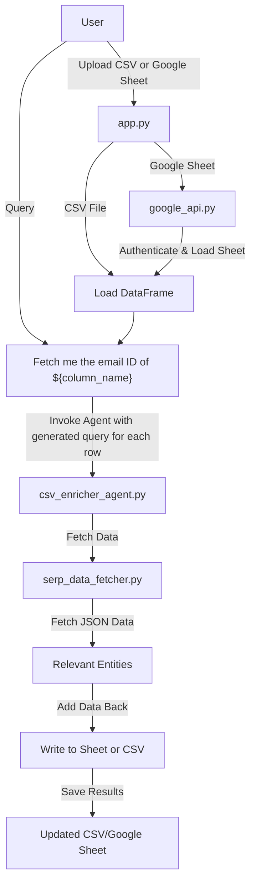

# Spreadsheet Enricher

## Overview
The **Spreadsheet Enricher** is a Streamlit application that allows users to enrich their spreadsheet data by leveraging AI-powered queries. Users can upload a CSV file or link a Google Sheet, specify a query to enhance their data, and receive enriched results that can be saved back to Google Sheets or downloaded as a CSV file.

## Project Structure
 ```bash
csv-enricher-agent/
├── csv_enricher_agent/
│   ├── backend/ 
│   ├── agent/
│       ├── prompts/
│           ├── prompt.py
│       ├── tools/
│           ├── serp_data_fetcher.py
│       ├── csv_enricher_agent.py
│   ├── google_api.py
├── tests/
├── .env
├── app.py
├── poetry.lock
├── pyproject.toml
├── README.md
├── .gitignore
├── LICENSE
 ```
## Explanation of Key Files and Directories

**1. csv_enricher_agent:** 
This directory contains the main codebase for the project. Includes submodules for backend processing, utilities, Google API integration, and search services.

**2. .env:** 
The `.env` file should be added with OPENAI_API_KEY and SERP_API_KEY. This file is not checked in for security reasons. 

**3. app.py:** 
The main file that serves the Streamlit application.

**4. tests:** 
This directory is reserved for unit and integration tests for the project. Testing has not been implemented for this project.

**5. poetry.lock & pyproject.toml:** Manage dependencies and configurations for the project using Poetry.

**6. LICENSE:** 
The license under which the project is distributed (MIT License in this case).


## Prerequisites
1. **Python Installation**: Ensure Python 3.8 or higher is installed. 
2. **Poetry Installation**: Install Poetry for dependency management and packaging.
    ```bash
    pip install poetry
    ```
3. **API Keys**:
    - OpenAI API Key: Save your OpenAI API key in a `.env` file as:
      ```env
      OPENAI_API_KEY=your_openai_api_key
      ```
    - SerpAPI Key: Add your SerpAPI key to the `.env` file:
      ```env
      SERP_API_KEY=your_serp_api_key
      ```
4. **Google Sheets Credentials**:
    - If working with Google Sheets, obtain your credentials JSON file from the Google Cloud Console.
    - Ensure the credentials have access to Google Sheets and Drive APIs.

## Installation
1. Clone the repository:
    ```bash
    git clone https://github.com/sakshepathak/csv-enricher.git
    ```
2. Go to the directory containing `pyproject.toml`
    ```bash
    cd csv-enricher/csv-enricher-agent
    ```
3. Install dependencies with Poetry:
    ```bash
    poetry install
    ```

## Usage
1. Activate the Poetry environment:
    ```bash
    poetry shell
    ```
2. Run the Streamlit app:
    ```bash
    cd csv_enricher_agent
    streamlit run app.py
    ```
Note: If poetry shell fails, you can skip that part. Just do `poetry run streamlit run app.py`.

## Input Options
### 1. Upload CSV File
- Prepare a CSV file with the data you want to enrich.
- Use the "Upload CSV" option in the app to load your file.

### 2. Link Google Sheets
- Ensure your Google Sheets credentials JSON file is ready.
- Upload the credentials and provide the URL of the Google Sheet. Make sure that the google sheet is shared to your service account that you created in Google Cloud Console.
- The app will read the first sheet from the linked Google Sheet.

## Features
1. **Column Selection**: Choose specific columns from your data to work with.
2. **Custom Queries**: Enter AI queries in the format like:
   - Example: `What is the email ID for ${column_name}`
   - The `{column_name}` placeholder will be replaced by values in the selected column.
3. **Results**:
   - Enriched data will be displayed, including additional columns for AI outputs and search results.
4. **Save Options**:
   - Save enriched data back to the Google Sheet (if linked).
   - Download enriched data as a CSV file.

## Notes
- For Google Sheets, ensure the credentials JSON file is valid and matches the account with access to the sheet.
- The `.env` file must be placed in the root directory of the project for environment variable loading.

## Troubleshooting
- **Dependencies Issue**: Run `poetry install` to ensure all dependencies are installed.
- **Google Sheets Error**: Verify that the credentials JSON file is correct and the sheet URL is accessible.
- **Dependency Errors:** If you encounter errors during setup (e.g., related to SerpAPI or any other dependencies), it might be due to existing or conflicting installations. To resolve this:

1. Identify if the dependency causing the issue is already installed:
```bash
poetry show <dependency-name>
```

2. If the dependency exists but still causes issues, remove it:
```bash
poetry remove <dependency-name>
```

3. Re-add the dependency to ensure proper installation:
```bash
poetry add <dependency-name>
```

## Contribution
Feel free to fork this repository and submit pull requests for any improvements or bug fixes.

## License
This project is licensed under the MIT License. See the `LICENSE` file for details.
